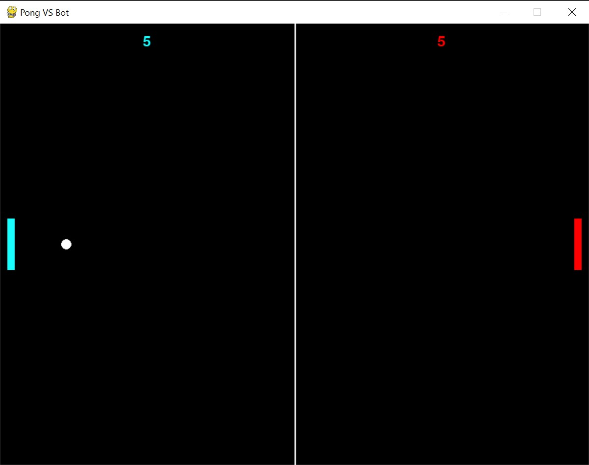
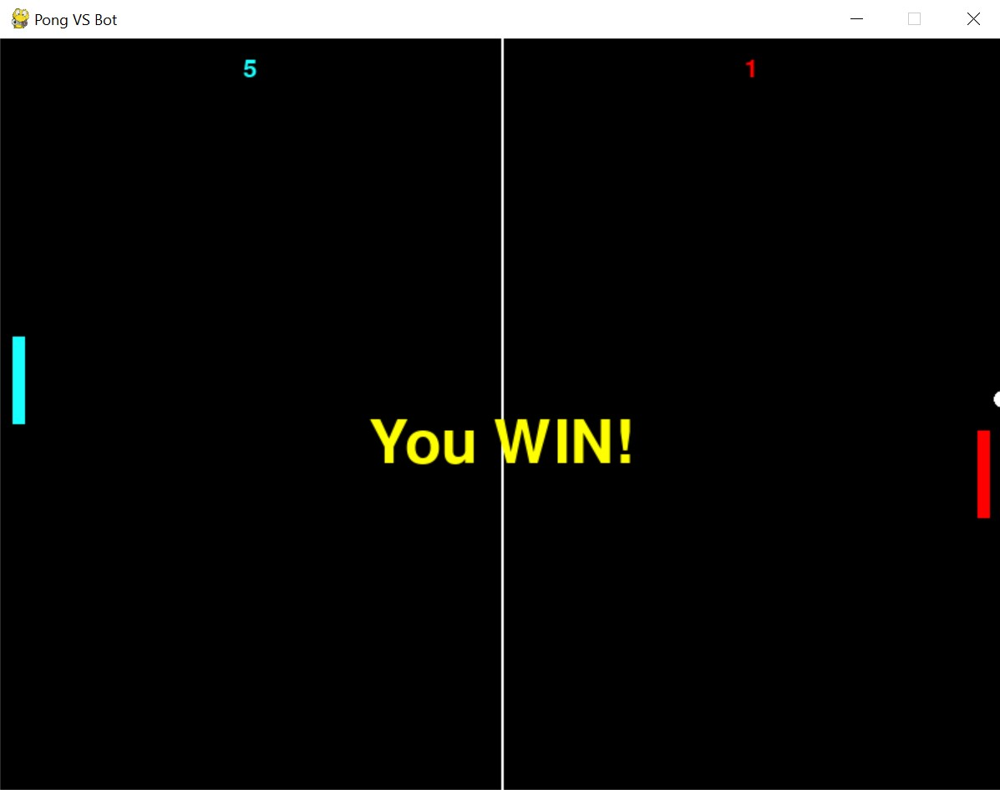
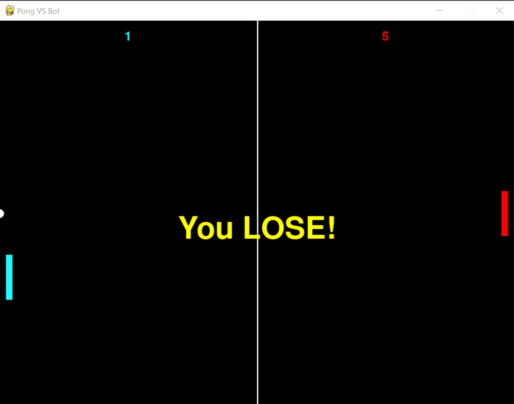

# Pong vs Bot
Pong game created using Pygame. Player plays against a Bot. Player and Bot have 5 lives.

Bot uses the vertical position of the puck to position itself so it can hit the puck back towards the player.

## Starting the Game
Game initially starts the Player and Bot with 5 lives.

## Win
If you beat the Bot, you win!

## Lose
If the Bot beats you, you lose!

